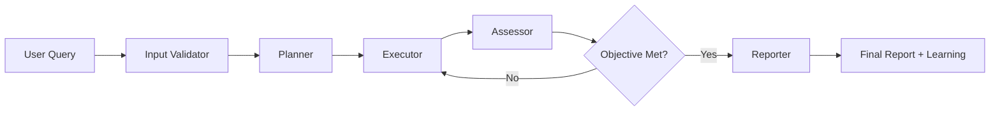

# 🚀 SP Oncall: Intelligent Network Investigation with Multi-Agent LangGraph

SP Oncall is an advanced AI-powered network investigation system that orchestrates a specialized graph of agents to automate complex network diagnostics and troubleshooting. Built with [LangGraph](https://github.com/langchain-ai/langgraph), it provides intelligent, concurrent analysis of multiple network devices while learning from each investigation to improve future performance.

## 🛠️ Prerequisites

The following prerequisites are required before using SP Oncall:

- **[uv](https://docs.astral.sh/uv/#installation)** - Python package manager.
- **[OpenAI API Key](https://platform.openai.com/)**.
- **[LangSmith Account](https://smith.langchain.com/)** - For Langgraph Studio, tracing and debugging.
- **Network Devices** - Accessible via gNMI, or use [DevNet sandbox](https://devnetsandbox.cisco.com/DevNet/) for testing.

## ⚡️ Quick Start Guide

### 1. 📁 Clone and Setup

```bash
git clone https://github.com/jillesca/sp_oncall
cd sp_oncall
```

### 2. 🔐 Environment Configuration

Create a `.env` file in the project root with your API keys:

```bash
# .env file - Required for operation
OPENAI_API_KEY=your-openai-api-key-here
LANGSMITH_API_KEY=your-langsmith-api-key-here
LANGSMITH_PROJECT=your-project-name
LANGSMITH_TRACING=true
LANGSMITH_ENDPOINT=https://api.smith.langchain.com

# Optional: Enable detailed LangChain debugging
SP_ONCALL_LANGCHAIN_DEBUG=false
```

### 3. 🔌 MCP Configuration

SP Oncall uses [gNMIBuddy](https://github.com/jillesca/gNMIBuddy) MCP server to extract data from network devices. The MCP configuration is defined in [mcp_config.json](mcp_config.json)

```json
{
  "gNMIBuddy": {
    "command": "uvx",
    "args": [
      "--from",
      "git+https://github.com/jillesca/gNMIBuddy.git",
      "gnmibuddy-mcp"
    ],
    "transport": "stdio",
    "env": {
      "NETWORK_INVENTORY": "xrd_sandbox.json"
    }
  }
}
```

> [!NOTE]
> Replace `xrd_sandbox.json` by your device inventory if not using the [DevNet Sandbox](https://devnetsandbox.cisco.com/DevNet/).

### 4. 🚀 Installation and Launch

Install dependencies and start the investigation system:

```bash
make run
```

This command will:

- Install all Python dependencies via `uv`
- Start the LangGraph dev server

### 5. 💻 Usage Examples

Once running, you can submit various types of requests:

**Single Device Investigation:**

```text
"Check BGP neighbors on xrd-1"
"Review the health of xrd-8"
```

**Multi-Device by Role:**

```text
"How are my PE routers performing?"
"Check all route reflectors"
"Investigate all core P devices"
```

**Pattern-Based Investigation:**

```text
"Check interfaces on devices matching 'xrd-*'"
```

## 🧪 Testing with DevNet Sandbox

Don't have network devices? No problem! Use the [DevNet XRd Sandbox](https://devnetsandbox.cisco.com/DevNet/) to test SP Oncall:

### 🏗️ Sandbox Setup

1. Reserve the **XRd sandbox**.
2. Follow sandbox instructions to bring up the SR MPLS network with Docker.
3. Configure gNMI on the simulated devices.

### 📚 Detailed gNMI Setup Guide

To configure the gNMI on the XRd DevNet sandbox you can use a helper script:

```bash
ANSIBLE_HOST_KEY_CHECKING=False \
bash -c 'TMPDIR=$(mktemp -d) \
&& trap "rm -rf $TMPDIR" EXIT \
&& curl -s https://raw.githubusercontent.com/jillesca/gNMIBuddy/refs/heads/main/ansible-helper/xrd_apply_config.yaml > "$TMPDIR/playbook.yaml" \
&& curl -s https://raw.githubusercontent.com/jillesca/gNMIBuddy/refs/heads/main/ansible-helper/hosts > "$TMPDIR/hosts" \
&& uvx --from ansible-core --with "paramiko,ansible" ansible-playbook "$TMPDIR/playbook.yaml" -i "$TMPDIR/hosts"'
```

<details>
<summary><strong>If you have problems with Ansible</strong></summary>

Enable manually gNMI. Apply this configuration to all XRd devices:

```bash
grpc
 port 57777
 no-tls
```

Don't forget to `commit` your changes to XRd.

</details>

## 🤖 Graph of Agents Architecture

The system employs a sophisticated multi-agent workflow with five specialized nodes that work together to deliver comprehensive network investigations:

### 🔍 Input Validator

- **Purpose**: Validates user queries and identifies target devices for investigation
- **Capabilities**:
  - Parses natural language requests (single device, multiple devices, or role-based queries)
  - Validates device existence against network inventory via gNMIBuddy
  - Supports flexible device discovery by name, role, or pattern matching
  - Extracts device profiles and roles for intelligent planning

### 📋 Planner

- **Purpose**: Creates tailored investigation strategies for each identified device
- **Capabilities**:
  - Generates device-specific objectives and investigation plans
  - Adapts plans based on device roles (PE, P, RR, etc.) and characteristics
  - Seeds from static JSON plans but customizes for each device's context
  - Considers device dependencies and investigation priorities
  - Leverages historical context to avoid redundant checks

### ⚡ Executor

- **Purpose**: Executes network investigations concurrently across multiple devices
- **Capabilities**:
  - **Parallel Processing**: Investigates multiple devices simultaneously for improved efficiency
  - Dynamically selects appropriate gNMIBuddy tools and parameters
  - Handles device-specific protocols and configurations
  - Manages execution results and error handling per device
  - Supports concurrent investigation by device name, role, or type

### 🎯 Assessor

- **Purpose**: Evaluates investigation results against objectives
- **Capabilities**:
  - Analyzes execution results for completeness and quality
  - Determines if investigation objectives were met
  - Provides intelligent retry logic with feedback
  - Identifies areas needing additional investigation

### 📊 Reporter

- **Purpose**: Generates comprehensive reports and manages knowledge retention
- **Capabilities**:
  - Creates detailed investigation summaries combining all device results
  - **Historical Context Management**: Maintains session history with previous reports
  - **Learning Insights Extraction**: Uses LLM analysis to identify patterns and relationships
  - **Device Relationship Discovery**: Maps network dependencies and connectivity patterns
  - Stores learned patterns for future investigation context

## 🎯 Key Features

### 📚 Intelligent Learning & History

- **Session History**: Maintains history of previous investigations with full reports
- **Learning Insights**: Automatically extracts valuable patterns from each investigation:
  - Common configuration patterns across device roles
  - Operational behaviors and troubleshooting approaches
  - Network architecture insights and performance patterns
- **Device Relationships**: Discovers and maps network relationships:
  - Physical and logical connections between devices
  - Dependencies affecting investigation order
  - Traffic flow and control plane relationships (BGP, ISIS, OSPF)
- **Context-Aware Planning**: Uses historical insights to inform future investigations

### 🚀 Advanced Multi-Device Processing

- **Concurrent Execution**: Investigates multiple devices in parallel for maximum efficiency
- **Flexible Device Targeting**:
  - **By Name**: Specific device names (e.g., "router-01", "pe-core-01")
  - **By Role**: Device functions (e.g., "all PE routers", "core P devices", "route reflectors")
  - **By Pattern**: Pattern matching (e.g., "all edge devices", "devices in region A")
- **Priority-Based Investigation**: HIGH/MEDIUM/LOW priority levels for resource optimization
- **Dependency Management**: Handles investigation order based on device dependencies

### 📋 Dynamic Plan Generation

- **Static Plan Seeding**: Uses predefined JSON plans as starting templates:
  - `general_device_health_check.json`
  - `check_bgp_neighbors.json`
  - `check_interface_status.json`
  - `check_mpls_state.json`
  - `review_p_device.json`, `review_pe_device.json`, `review_rr_device.json`
  - `troubleshoot_vpn_vrf.json`
- **Adaptive Planning**: Executor can modify plans per device based on:
  - Device role and capabilities
  - Historical findings and patterns
  - Current network state and context
  - Investigation priority and scope

### 🔄 Intelligent Retry & Assessment

- **Smart Retry Logic**: Automated retry with feedback when objectives aren't met
- **Continuous Assessment**: Real-time evaluation of investigation progress
- **Error Handling**: Graceful handling of device communication issues

## 🔧 Configuration Options

### LLM Model Selection

Configure your preferred LLM model in the `Configuration` class:

- OpenAI: `gpt-4`, `gpt-4o-mini`, `gpt-5-nano`
- Ollama: `qwen3:8b`, `llama3.1`

### Investigation Plans

Customize investigation behaviors by editing plans in the `/plans` directory:

- Add new investigation types
- Modify existing plan steps
- Create role-specific investigation flows

### Logging and Debug

- Set `SP_ONCALL_LANGCHAIN_DEBUG=true` for detailed tracing
- Use LangSmith for comprehensive investigation monitoring
- Review logs in `/logs/debug/` for troubleshooting

## 🏗️ Architecture Deep Dive

The system implements a sophisticated state machine using LangGraph:



**Key Architectural Benefits:**

- 🔄 **Stateful Workflow**: Maintains context throughout complex investigations
- 🧠 **Learning System**: Continuously improves through pattern recognition
- 🚀 **Concurrent Processing**: Handles multiple devices efficiently
- 🎯 **Adaptive Planning**: Tailors strategies to device roles and context
- 📊 **Comprehensive Reporting**: Combines technical findings with learned insights

---

**Ready to revolutionize your network investigations?** 🚀 Start with the quick start guide above and experience intelligent, AI-powered network diagnostics!
