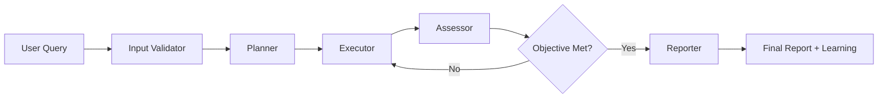

# 🚀 SP Oncall: Intelligent Network Investigation with Multi-Agent LangGraph

SP Oncall is an advanced AI-powered network investigation system that orchestrates a specialized graph of agents to automate complex network diagnostics and troubleshooting. Built with [LangGraph](https://github.com/langchain-ai/langgraph), it provides intelligent, concurrent analysis of multiple network devices while learning from each investigation to improve future performance.

## 🛠️ Prerequisites

Before using SP Oncall, ensure you have the following:

- **[uv](https://docs.astral.sh/uv/#installation)** - Python package manager (required)
- **OpenAI API Key** - For LLM-powered agent intelligence
- **LangSmith Account** - For tracing and debugging (recommended)
- **[gNMIBuddy](https://github.com/jillesca/gNMIBuddy)** - Network device communication tool (via MCP)
- **Network Devices** - Accessible via gNMI protocol, or use DevNet sandbox

## ⚡️ Quick Start Guide

### 1. 📁 Clone and Setup

```bash
git clone <your-repo-url>
cd sp_oncall
```

### 2. 🔐 Environment Configuration

Create a `.env` file in the project root with your API keys:

```bash
# .env file - Required for operation
OPENAI_API_KEY=your-openai-api-key-here
LANGSMITH_API_KEY=your-langsmith-api-key-here
LANGSMITH_PROJECT=sp-oncall-investigations
LANGSMITH_TRACING=true
LANGSMITH_ENDPOINT=https://api.smith.langchain.com

# Optional: Enable detailed LangChain debugging
SP_ONCALL_LANGCHAIN_DEBUG=false
```

**Required Environment Variables:**

- `OPENAI_API_KEY`: Your OpenAI API key for LLM functionality
- `LANGSMITH_API_KEY`: Your LangSmith API key for tracing and monitoring
- `LANGSMITH_PROJECT`: Project name for organizing your investigation traces

### 3. 🔌 MCP Server Configuration

SP Oncall uses [gNMIBuddy](https://github.com/jillesca/gNMIBuddy) via the Model Context Protocol (MCP) for network device communication. The MCP configuration is defined in `mcp_config.json`:

```json
{
  "gNMIBuddy": {
    "command": "uvx",
    "args": [
      "--from",
      "git+https://github.com/jillesca/gNMIBuddy.git",
      "gnmibuddy-mcp"
    ],
    "transport": "stdio",
    "env": {
      "NETWORK_INVENTORY": "xrd_sandbox.json"
    }
  }
}
```

**Important**: Ensure your network inventory file (`xrd_sandbox.json`) contains your device definitions.

### 4. 🚀 Installation and Launch

Install dependencies and start the investigation system:

```bash
make run
```

This command will:

- Install all Python dependencies via uv
- Configure the MCP client connection to gNMIBuddy
- Start the LangGraph workflow server
- Make the system ready for investigations

### 5. 💻 Usage Examples

Once running, you can submit various types of investigation requests:

**Single Device Investigation:**

```text
"Check BGP neighbors on pe-router-01"
"Review the health of core-rtr-01"
```

**Multi-Device by Role:**

```text
"How are my PE routers performing?"
"Check all route reflectors"
"Investigate all core P devices"
```

**Pattern-Based Investigation:**

```text
"Analyze all edge devices in region A"
"Check interfaces on devices matching 'access-*'"
```

**Complex Investigations:**

```text
"Troubleshoot MPLS connectivity between sites"
"Review VPN status across all PE devices"
```

## 🧪 Testing with DevNet Sandbox

Don't have network devices? No problem! Use the [DevNet XRd Sandbox](https://devnetsandbox.cisco.com/DevNet/) to test SP Oncall:

### 🏗️ Sandbox Setup

1. Reserve the **IOS XRd MPLS Topology** sandbox
2. Follow sandbox instructions to bring up the MPLS network with Docker
3. Configure gNMI on the simulated devices
4. Update your inventory file to point to the sandbox devices

### 📚 Detailed gNMI Setup Guide

For complete instructions on configuring the DevNet sandbox with gNMI support, visit:
👉 **[gNMIBuddy Sandbox Setup Guide](https://github.com/jillesca/gNMIBuddy?tab=readme-ov-file#-testing-with-devnet-sandbox)**

This guide covers:

- 🔧 Enabling gNMI on XRd devices
- 📝 Creating inventory files
- 🔐 Setting up authentication
- 🧪 Testing connectivity

## 🤖 Graph of Agents Architecture

The system employs a sophisticated multi-agent workflow with five specialized nodes that work together to deliver comprehensive network investigations:

### 🔍 Input Validator

- **Purpose**: Validates user queries and identifies target devices for investigation
- **Capabilities**:
  - Parses natural language requests (single device, multiple devices, or role-based queries)
  - Validates device existence against network inventory via gNMIBuddy
  - Supports flexible device discovery by name, role, or pattern matching
  - Extracts device profiles and roles for intelligent planning

### 📋 Planner

- **Purpose**: Creates tailored investigation strategies for each identified device
- **Capabilities**:
  - Generates device-specific objectives and investigation plans
  - Adapts plans based on device roles (PE, P, RR, etc.) and characteristics
  - Seeds from static JSON plans but customizes for each device's context
  - Considers device dependencies and investigation priorities
  - Leverages historical context to avoid redundant checks

### ⚡ Executor

- **Purpose**: Executes network investigations concurrently across multiple devices
- **Capabilities**:
  - **Parallel Processing**: Investigates multiple devices simultaneously for improved efficiency
  - Dynamically selects appropriate gNMIBuddy tools and parameters
  - Handles device-specific protocols and configurations
  - Manages execution results and error handling per device
  - Supports concurrent investigation by device name, role, or type

### 🎯 Assessor

- **Purpose**: Evaluates investigation results against objectives
- **Capabilities**:
  - Analyzes execution results for completeness and quality
  - Determines if investigation objectives were met
  - Provides intelligent retry logic with feedback
  - Identifies areas needing additional investigation

### 📊 Reporter

- **Purpose**: Generates comprehensive reports and manages knowledge retention
- **Capabilities**:
  - Creates detailed investigation summaries combining all device results
  - **Historical Context Management**: Maintains session history with previous reports
  - **Learning Insights Extraction**: Uses LLM analysis to identify patterns and relationships
  - **Device Relationship Discovery**: Maps network dependencies and connectivity patterns
  - Stores learned patterns for future investigation context

## 🎯 Key Features

### 📚 Intelligent Learning & History

- **Session History**: Maintains history of previous investigations with full reports
- **Learning Insights**: Automatically extracts valuable patterns from each investigation:
  - Common configuration patterns across device roles
  - Operational behaviors and troubleshooting approaches
  - Network architecture insights and performance patterns
- **Device Relationships**: Discovers and maps network relationships:
  - Physical and logical connections between devices
  - Dependencies affecting investigation order
  - Traffic flow and control plane relationships (BGP, ISIS, OSPF)
- **Context-Aware Planning**: Uses historical insights to inform future investigations

### 🚀 Advanced Multi-Device Processing

- **Concurrent Execution**: Investigates multiple devices in parallel for maximum efficiency
- **Flexible Device Targeting**:
  - **By Name**: Specific device names (e.g., "router-01", "pe-core-01")
  - **By Role**: Device functions (e.g., "all PE routers", "core P devices", "route reflectors")
  - **By Pattern**: Pattern matching (e.g., "all edge devices", "devices in region A")
- **Priority-Based Investigation**: HIGH/MEDIUM/LOW priority levels for resource optimization
- **Dependency Management**: Handles investigation order based on device dependencies

### 📋 Dynamic Plan Generation

- **Static Plan Seeding**: Uses predefined JSON plans as starting templates:
  - `general_device_health_check.json`
  - `check_bgp_neighbors.json`
  - `check_interface_status.json`
  - `check_mpls_state.json`
  - `review_p_device.json`, `review_pe_device.json`, `review_rr_device.json`
  - `troubleshoot_vpn_vrf.json`
- **Adaptive Planning**: Executor can modify plans per device based on:
  - Device role and capabilities
  - Historical findings and patterns
  - Current network state and context
  - Investigation priority and scope

### 🔄 Intelligent Retry & Assessment

- **Smart Retry Logic**: Automated retry with feedback when objectives aren't met
- **Continuous Assessment**: Real-time evaluation of investigation progress
- **Error Handling**: Graceful handling of device communication issues

## 🔧 Configuration Options

### LLM Model Selection

Configure your preferred LLM model in the `Configuration` class:

- OpenAI: `gpt-4`, `gpt-4o-mini`, `gpt-5-nano`
- Ollama: `qwen3:8b`, `llama3.1`

### Investigation Plans

Customize investigation behaviors by editing plans in the `/plans` directory:

- Add new investigation types
- Modify existing plan steps
- Create role-specific investigation flows

### Logging and Debug

- Set `SP_ONCALL_LANGCHAIN_DEBUG=true` for detailed tracing
- Use LangSmith for comprehensive investigation monitoring
- Review logs in `/logs/debug/` for troubleshooting

## 🏗️ Architecture Deep Dive

The system implements a sophisticated state machine using LangGraph:



**Key Architectural Benefits:**

- 🔄 **Stateful Workflow**: Maintains context throughout complex investigations
- 🧠 **Learning System**: Continuously improves through pattern recognition
- 🚀 **Concurrent Processing**: Handles multiple devices efficiently
- 🎯 **Adaptive Planning**: Tailors strategies to device roles and context
- 📊 **Comprehensive Reporting**: Combines technical findings with learned insights

---

**Ready to revolutionize your network investigations?** 🚀 Start with the quick start guide above and experience intelligent, AI-powered network diagnostics!
