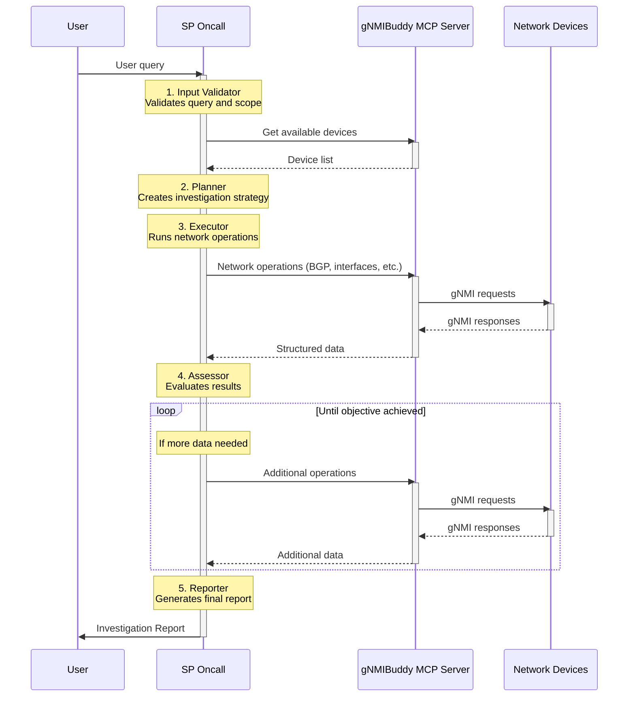

# 🚀 SP Oncall: Multi-Agent Network Investigation

[](https://developer.cisco.com/codeexchange/github/repo/jillesca/sp_oncall)

SP Oncall is an experiment about a network investigation system that automates complex network diagnostics and troubleshooting for Service Provider (SP) networks. It uses artificial intelligence to analyze network devices, identify issues, and provide detailed reports. I'm mostly using it to learn and demo about AI solutions for networking.

## 🤖 What Does It Do?

Think of SP Oncall as a team of specialized AI agents that work together to investigate network problems:

- 🔍 **Input Validator** - Understands your questions and identifies which network devices to investigate.
- 📋 **Planner** - Creates a customized investigation strategy for each device.
- ⚡ **Executor** - Runs the actual network commands and collects data from your devices.
- 🎯 **Assessor** - Checks if the investigation found what you were looking for.
- 📊 **Reporter** - Creates easy-to-understand reports and remembers what it learned.


## 🏗️ Architecture

The system uses a multi-agent architecture where specialized AI agents collaborate to investigate network issues. Here's how the workflow operates from user query to final report:



## 🎯 Key Features

- **Learning**: Remembers past investigations and uses that knowledge to plan better future investigations.
- **Multi-Device Processing**: Can investigate multiple network devices at the same time.
- **Flexible Targeting**: Can target devices by name, role (like "edge routers" or "core switches"), or pattern matching.
- **Self-Checking**: Automatically retries if it doesn't get the information it needs.
- **Detailed Reporting**: Creates comprehensive reports while saving insights for future use.

## 🛠️ Prerequisites

Before you can use SP Oncall, you'll need these tools installed on your system:

- **Make** - A build automation tool that helps run common commands (install via your package manager).
- **[uv](https://docs.astral.sh/uv/#installation)** - A fast Python package manager (alternative to pip).
- **[OpenAI API Key](https://platform.openai.com/)** - Required if using OpenAI models (default).
- **[LangSmith Account](https://smith.langchain.com/)** - For Langgraph Studio.
- **Network Devices** - Your actual network equipment, or use [DevNet sandbox](https://devnetsandbox.cisco.com/DevNet/) for testing

**Windows users**: This project requires a Unix-like environment. Install [WSL (Windows Subsystem for Linux)](https://docs.microsoft.com/en-us/windows/wsl/install) to run it on Windows.

## ⚡️ Quick Start Guide

### 1. 📁 Clone and Setup

```bash
git clone https://github.com/jillesca/sp_oncall
cd sp_oncall
```

### 2. 🔐 Environment Configuration

Create a `.env` file in the project root with your API keys:

```bash
# .env file - Required for operation
OPENAI_API_KEY=your-openai-api-key-here
LANGSMITH_API_KEY=your-langsmith-api-key-here
LANGSMITH_PROJECT=your-project-name
LANGSMITH_TRACING=true
LANGSMITH_ENDPOINT=https://api.smith.langchain.com
```

### 3. 🔌 Network Device Access

SP Oncall uses [gNMIBuddy](https://github.com/jillesca/gNMIBuddy) MCP server to extract data from network devices. The MCP configuration is defined in [mcp_config.json](mcp_config.json).

```json
{
  "gNMIBuddy": {
    "command": "uvx",
    "args": [
      "--from",
      "git+https://github.com/jillesca/gNMIBuddy.git",
      "gnmibuddy-mcp"
    ],
    "transport": "stdio",
    "env": {
      "NETWORK_INVENTORY": "xrd_sandbox.json"
    }
  }
}
```

> [!NOTE]
> If you're not using the DevNet Sandbox, replace `xrd_sandbox.json` with your own device inventory file.

### 4. 🚀 Installation and Launch

Install dependencies and start the investigation system:

```bash
# First time only - installs all required Python packages
make install

# Start the investigation system (opens a web interface)
make run
```

The `make install` command will:

- Install all Python dependencies using the exact versions specified in `uv.lock` (ensures consistency).

The `make run` command will:

- Start the LangGraph development server (a web interface for interacting with the AI agents).

### 5. 💻 Usage Examples

Once running, you can ask the system to investigate your network in various ways:

**Single Device Investigation:**

```text
"Check BGP neighbors on xrd-1"
"Review the health of xrd-8"
```

**Multi-Device by Role:**

```text
"How are my PE routers performing?" (PE = Provider Edge - routers that connect to customer networks)
"Check all route reflectors" (Route reflectors help distribute routing information)
"Investigate all core P devices" (P = Provider - core network routers)
```

**Pattern-Based Investigation:**

```text
"Check interfaces on devices matching 'xrd-*'"
```

## 🧪 Testing with DevNet Sandbox

Don't have network devices? No problem! Use the [DevNet XRd Sandbox](https://devnetsandbox.cisco.com/DevNet/) - a free environment for testing.

### 🏗️ Sandbox Setup

1. Reserve the DevNet **XRd Sandbox** (free account required)
2. Follow the sandbox instructions to start the containerized SR MPLS network using Docker
3. Configure gNMI on the simulated devices (gNMI is like a modern replacement for SSH/CLI access)

To automatically configure gNMI on the XRd DevNet sandbox, you can use this helper script:

```bash
ANSIBLE_HOST_KEY_CHECKING=False \
bash -c 'TMPDIR=$(mktemp -d) \
&& trap "rm -rf $TMPDIR" EXIT \
&& curl -s https://raw.githubusercontent.com/jillesca/gNMIBuddy/refs/heads/main/ansible-helper/xrd_apply_config.yaml > "$TMPDIR/playbook.yaml" \
&& curl -s https://raw.githubusercontent.com/jillesca/gNMIBuddy/refs/heads/main/ansible-helper/hosts > "$TMPDIR/hosts" \
&& uvx --from "ansible-core==2.19.2" --with "paramiko,ansible" ansible-playbook "$TMPDIR/playbook.yaml" -i "$TMPDIR/hosts"'
```

<details>
<summary><strong>If you have problems with Ansible</strong></summary>

You can manually enable gNMI on each XRd device. Apply this configuration to all XRd devices:

```bash
grpc
 port 57777
 no-tls
```

Don't forget to `commit` your changes to XRd.

</details>

## 🔧 Configuration

### AI Language Models

On the _Manage Assistants_ button in the web interface, you can select different AI models to try:

- **OpenAI**: `gpt-4`, `gpt-4o-mini`, `gpt-5-nano` (default - most capable)
- **Ollama**: `qwen3:8b`, `llama3.1` (experimental - poor results, runs locally)


### Investigation Plans

The system uses predefined investigation strategies stored as JSON files in the `/plans` directory:

- Device health checks, BGP analysis, interface monitoring, MPLS state verification
- Role-specific flows for different types of network devices (PE, P, route reflectors)
- These plans are starting points - the AI executor adapts them based on your specific situation

### Debug & Monitoring

The system includes comprehensive logging to help you understand what's happening:

- **Environment Control**:
  - Set `SP_ONCALL_LOG_LEVEL=debug` for detailed logging
  - Set `SP_ONCALL_LANGCHAIN_DEBUG=true` for LangChain framework logging
- **Module-Specific Levels**: Configure individual component verbosity (e.g., `SP_ONCALL_MODULE_LEVELS="sp_oncall.nodes=debug,langgraph=error"`)
  - Use `make logger-names` to see all available logging modules
- **Object Debug Capture**: Use `SP_ONCALL_DEBUG_CAPTURE=1` to automatically save complex objects to log files for offline analysis

For detailed logging configuration and advanced features, see [src/logging/README.md](src/logging/README.md). For debug capture objects, see [docs/DEBUG_CAPTURE.md](docs/DEBUG_CAPTURE.md).

## 🆘 Getting Help

- **Issues**: Check the [GitHub issues](https://github.com/jillesca/sp_oncall/issues) page
- **Questions**: Open a new issue with your question
- **Contributing**: Right now this is proof of concept experiment. Feel free to fork.

## 📚 Learn More

- **gNMI**: [gRPC Network Management Interface](https://github.com/openconfig/reference/blob/master/rpc/gnmi/gnmi-specification.md)
- **LangGraph**: [LangChain's workflow framework](https://langchain-ai.github.io/langgraph/)
- **DevNet Sandbox**: [Cisco's free network simulation environment](https://devnetsandbox.cisco.com/DevNet/)
