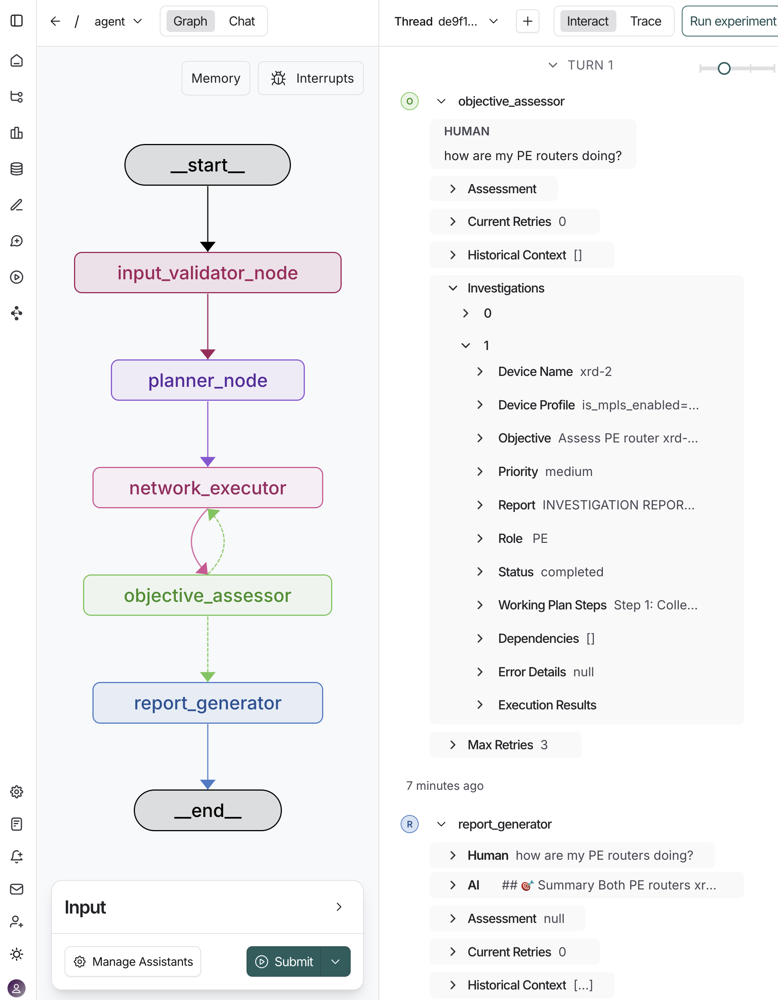
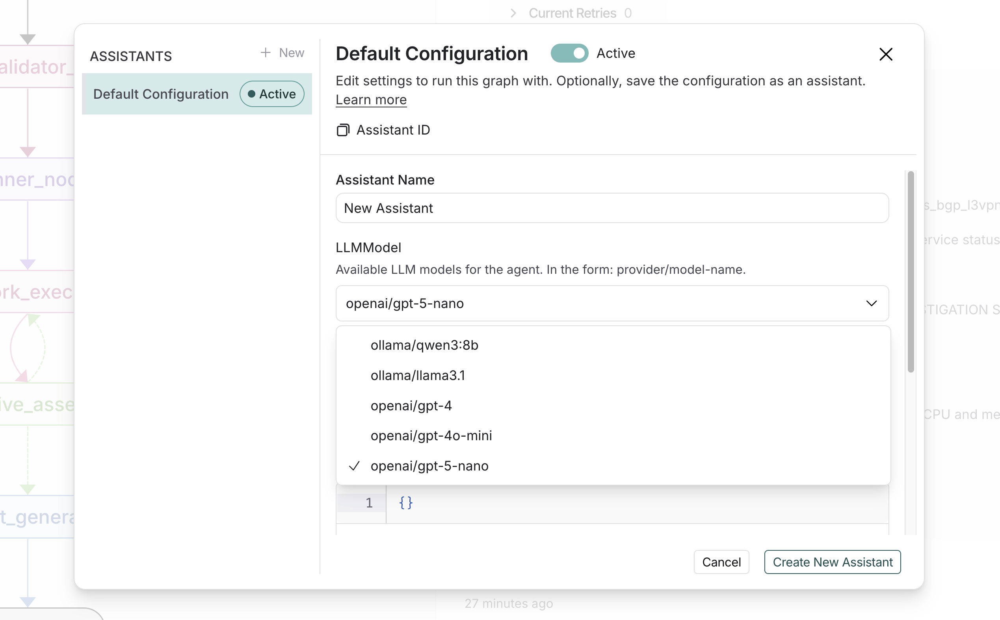

# 🚀 SP Oncall: Intelligent Network Investigation with Multi-Agent LangGraph

SP Oncall is an advanced AI-powered network investigation system that orchestrates a specialized graph of agents to automate complex network diagnostics and troubleshooting. Built with [LangGraph](https://github.com/langchain-ai/langgraph), it provides intelligent, concurrent analysis of multiple network devices while learning from each investigation to improve future performance.

## 🤖 Graph of Agents Architecture

The system uses a multi-agent workflow with five specialized agent nodes that work together to deliver completed network investigations:

- 🔍 **Input Validator** - Validates user queries and identifies target devices for investigation.
- 📋 **Planner** - Creates tailored investigation strategies for each identified device.
- ⚡ **Executor** - Executes network investigations concurrently across multiple devices.
- 🎯 **Assessor** - Evaluates investigation results against objectives.
- 📊 **Reporter** - Generates comprehensive reports and manages knowledge retention.



## 🎯 Key Features

- **Intelligent Learning**: Maintains investigation history and extracts operational patterns for context-aware planning.
- **Multi-Device Processing**: Concurrent execution across devices with flexible targeting by name, role, or pattern.
- **Dynamic Planning**: Uses predefined JSON templates as starting points, then adapts plans per device based on role, capabilities, and context.
- **Smart Assessment**: Continuous evaluation with automated retry logic when objectives aren't met.
- **Comprehensive Reporting**: Generates detailed reports while preserving learned insights for future investigations.

## 🛠️ Prerequisites

The following prerequisites are required before using SP Oncall:

- **[uv](https://docs.astral.sh/uv/#installation)** - Python package manager.
- **[OpenAI API Key](https://platform.openai.com/)**.
- **[LangSmith Account](https://smith.langchain.com/)** - For Langgraph Studio, tracing and debugging.
- **Network Devices** - Accessible via gNMI, or use [DevNet sandbox](https://devnetsandbox.cisco.com/DevNet/) for testing.

## ⚡️ Quick Start Guide

### 1. 📁 Clone and Setup

```bash
git clone https://github.com/jillesca/sp_oncall
cd sp_oncall
```

### 2. 🔐 Environment Configuration

Create a `.env` file in the project root with your API keys:

```bash
# .env file - Required for operation
OPENAI_API_KEY=your-openai-api-key-here
LANGSMITH_API_KEY=your-langsmith-api-key-here
LANGSMITH_PROJECT=your-project-name
LANGSMITH_TRACING=true
LANGSMITH_ENDPOINT=https://api.smith.langchain.com

# Optional: Enable detailed LangChain debugging
SP_ONCALL_LANGCHAIN_DEBUG=false
```

### 3. 🔌 MCP Configuration

SP Oncall uses [gNMIBuddy](https://github.com/jillesca/gNMIBuddy) MCP server to extract data from network devices. The MCP configuration is defined in [mcp_config.json](mcp_config.json)

```json
{
  "gNMIBuddy": {
    "command": "uvx",
    "args": [
      "--from",
      "git+https://github.com/jillesca/gNMIBuddy.git",
      "gnmibuddy-mcp"
    ],
    "transport": "stdio",
    "env": {
      "NETWORK_INVENTORY": "xrd_sandbox.json"
    }
  }
}
```

> [!NOTE]
> Replace `xrd_sandbox.json` by your device inventory if not using the [DevNet Sandbox](https://devnetsandbox.cisco.com/DevNet/).

### 4. 🚀 Installation and Launch

Install dependencies and start the investigation system:

```bash
# First time only: Install dependencies using the exact versions from uv.lock
make install

# Start the investigation system
make run
```

The `make install` command will:

- Install all Python dependencies using the exact versions specified in `uv.lock` (frozen dependencies).
- This ensures you have the same exact dependencies that were used during development.

The `make run` command will:

- Start the LangGraph dev server.
- Note: Dependencies only need to be installed once, unless you update them.

### 5. 💻 Usage Examples

Once running, you can submit various types of requests:

**Single Device Investigation:**

```text
"Check BGP neighbors on xrd-1"
"Review the health of xrd-8"
```

**Multi-Device by Role:**

```text
"How are my PE routers performing?"
"Check all route reflectors"
"Investigate all core P devices"
```

**Pattern-Based Investigation:**

```text
"Check interfaces on devices matching 'xrd-*'"
```

## 🧪 Testing with DevNet Sandbox

Don't have network devices? No problem! Use the [DevNet XRd Sandbox.](https://devnetsandbox.cisco.com/DevNet/)

### 🏗️ Sandbox Setup

1. Reserve the **XRd sandbox**.
2. Follow sandbox instructions to bring up the SR MPLS network with Docker.
3. Configure gNMI on the simulated devices.

To configure the gNMI on the XRd DevNet sandbox you can use a helper script:

```bash
ANSIBLE_HOST_KEY_CHECKING=False \
bash -c 'TMPDIR=$(mktemp -d) \
&& trap "rm -rf $TMPDIR" EXIT \
&& curl -s https://raw.githubusercontent.com/jillesca/gNMIBuddy/refs/heads/main/ansible-helper/xrd_apply_config.yaml > "$TMPDIR/playbook.yaml" \
&& curl -s https://raw.githubusercontent.com/jillesca/gNMIBuddy/refs/heads/main/ansible-helper/hosts > "$TMPDIR/hosts" \
&& uvx --from ansible-core --with "paramiko,ansible" ansible-playbook "$TMPDIR/playbook.yaml" -i "$TMPDIR/hosts"'
```

<details>
<summary><strong>If you have problems with Ansible</strong></summary>

Enable manually gNMI. Apply this configuration to all XRd devices:

```bash
grpc
 port 57777
 no-tls
```

Don't forget to `commit` your changes to XRd.

</details>

## 🔧 Configuration

### LLM Models

On the _Manage Assistants_ button you can select different LLMs to try.

- **OpenAI**: `gpt-4`, `gpt-4o-mini`, `gpt-5-nano` (default).
- **Ollama**: `qwen3:8b`, `llama3.1` (experimental).



### Investigation Plans

Customize behaviors by editing JSON plans in `/plans/`:

- Device health checks, BGP analysis, interface monitoring, MPLS state.
- Role-specific flows for PE, P, and route reflector devices.
- Plans serve as suggestions - the executor adapts them based on context.

### Debug & Monitoring

- Set `SP_ONCALL_LANGCHAIN_DEBUG=true` for detailed tracing.
- Use LangSmith for comprehensive investigation monitoring.
- Review logs in `/logs/debug/` for troubleshooting.
