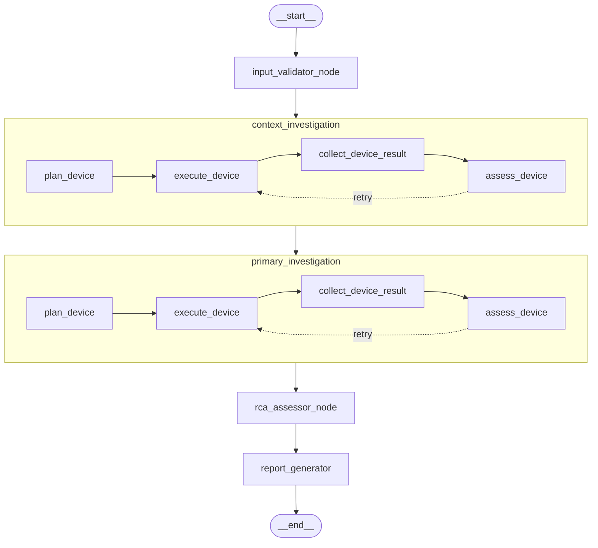

# SP Oncall: Multi-Agent Network Investigation

[](https://developer.cisco.com/codeexchange/github/repo/jillesca/sp_oncall)

SP Oncall is an experimental AI-driven network investigation system for Service Provider (SP) networks. It automates network diagnostics and troubleshooting by analyzing device state, identifying issues, and generating detailed root-cause reports. I'm mostly using it to learn and demo about AI solutions for networking.

## What Does It Do?

Think of SP Oncall as a team of specialized AI agents that work together to investigate network problems:

- **Input Validator** — Understands the incoming query or alert and decides which devices belong to the investigation.
- **Context Investigation** — Investigates related devices first, such as neighbors or surrounding topology, to build supporting context.
- **Primary Investigation** — Investigates the main target devices using the context-phase findings.
- **RCA Assessor** — Reviews the completed investigation phases and extracts the most likely root cause.
- **Report Generator** — Produces the final human-readable report and updates per-device history.

## Quick Demo

Watch [SP Oncall in Action](https://app.vidcast.io/share/71c7937d-645d-4226-87c6-883b49c0e4f3) (2:25) showing how to query the network using natural language.

## Architecture

The graph is a linear orchestration pipeline: `input_validator_node → context_investigation → primary_investigation → rca_assessor_node → report_generator`. Each investigation phase is a sub-graph that handles its own retries internally.

Inside each investigation sub-graph, you'll see four internal nodes in LangGraph Studio: `plan_device` (creates investigation strategy), `execute_device` (queries network devices), `collect_device_result` (aggregates findings), and `assess_device` (evaluates if objective is met). If assessment fails and retries remain, the phase loops back to execute.


```mermaid
flowchart TD
  start([__start__]) --> iv[input_validator_node]
  iv --> subgraph_context

  subgraph subgraph_context[context_investigation]
    cplan[plan_device] --> cexec[execute_device]
    cexec --> ccollect[collect_device_result]
    ccollect --> cassess[assess_device]
    cassess -. retry .-> cexec
  end

  subgraph_context --> subgraph_primary

  subgraph subgraph_primary[primary_investigation]
    pplan[plan_device] --> pexec[execute_device]
    pexec --> pcollect[collect_device_result]
    pcollect --> passess[assess_device]
    passess -. retry .-> pexec
  end

  subgraph_primary --> rca[rca_assessor_node]
  rca --> report[report_generator]
  report --> finish([__end__])
```

## Key Features

- **Manual-first workflow**: Run investigations directly in LangGraph Studio using natural-language queries.
- **Optional alert integration**: Connect to an external observability stack (like [xrd-observability-stack](https://github.com/jillesca/xrd-observability-stack)) for automated investigations triggered by network alerts.
- **Per-device memory**: Device Profiles store role, BGP AS, neighbors, and topology facts across runs, plus last alert and health status — all in the LangGraph Store, no external DB required.
- **Two-phase investigations**: Context phase investigates related devices (neighbors, topology) first; primary phase investigates target devices using context findings.
- **Multi-device concurrency**: Multiple devices are investigated in parallel within each phase.
- **Internal retry loop**: Each phase can retry up to `max_retries` times (default: 3) before moving on.
- **Skill-based planning**: Investigation strategies live in `skills/` as Markdown files. Manual queries use all skills; alert-triggered investigations filter by event type.
- **Follow-up questions**: After a run completes, continue the conversation in the same thread with full access to investigation state.

## Prerequisites

Before you can use SP Oncall, you'll need these tools installed on your system:

- **Make** — A build automation tool that helps run common commands (install via your package manager).
- **[uv](https://docs.astral.sh/uv/#installation)** — A fast Python package manager (alternative to pip).
- **[OpenAI API Key](https://platform.openai.com/)** — Required if using OpenAI models (default). OpenRouter is also supported.
- **[LangSmith Account](https://smith.langchain.com/)** — For LangGraph Studio.
- **Network Devices** — Your actual network equipment, or use the [DevNet XRd Sandbox](https://devnetsandbox.cisco.com/DevNet/) for testing.

**Windows users**: This project requires a Unix-like environment. Install [WSL (Windows Subsystem for Linux)](https://docs.microsoft.com/en-us/windows/wsl/install) to run it on Windows.

## Quick Start

### 1. Clone and install

```bash
git clone https://github.com/jillesca/sp_oncall
cd sp_oncall
make install
```

### 2. Configure environment

Copy `.env.example` to `.env` and fill in the required values:

```bash
cp .env.example .env
```

Required keys:

| Variable            | Description                               |
| ------------------- | ----------------------------------------- |
| `OPENAI_API_KEY`    | OpenAI API key                            |
| `LANGSMITH_API_KEY` | LangSmith API key (for tracing)           |
| `LANGSMITH_PROJECT` | LangSmith project name (e.g. `sp_oncall`) |
| `LANGSMITH_TRACING` | Set to `true` to enable tracing           |

See the [Configuration Reference](#configuration-reference) below for all available options.

### 3. Configure network device access

SP Oncall uses [gNMIBuddy](https://github.com/jillesca/gNMIBuddy) MCP server to query network devices. Point `mcp_config.json` at your running gNMIBuddy instance:

```json
{
  "gNMIBuddy": {
    "transport": "http",
    "url": "http://localhost:8000/mcp"
  }
}
```

### 4. Start

```bash
make run
```

This starts the LangGraph development server. Open LangGraph Studio at the URL shown in the terminal.

### 5. Send a query

In LangGraph Studio, start a new thread and type a query:

```text
Check BGP neighbors on xrd-1
How are my PE routers performing?
Investigate all core P devices
```

For the optional alert-driven companion flow, see [Optional Observability Integration](#optional-observability-integration) below.

## Testing with DevNet Sandbox

Don't have network devices? No problem! Use the [DevNet XRd Sandbox](https://devnetsandbox.cisco.com/DevNet/) — a free environment for testing.

### Sandbox Setup

1. Reserve the DevNet **XRd Sandbox** (free account required).
2. Follow the sandbox instructions to start the containerized SR MPLS network using Docker.
3. Configure gNMI on the simulated devices.

To automatically configure gNMI on the XRd DevNet sandbox, run this helper script:

```bash
ANSIBLE_HOST_KEY_CHECKING=False \
bash -c 'TMPDIR=$(mktemp -d) \
&& trap "rm -rf $TMPDIR" EXIT \
&& curl -s https://raw.githubusercontent.com/jillesca/gNMIBuddy/refs/heads/main/ansible-helper/xrd_apply_config.yaml > "$TMPDIR/playbook.yaml" \
&& curl -s https://raw.githubusercontent.com/jillesca/gNMIBuddy/refs/heads/main/ansible-helper/hosts > "$TMPDIR/hosts" \
&& uvx --from "ansible-core==2.19.2" --with "paramiko,ansible" ansible-playbook "$TMPDIR/playbook.yaml" -i "$TMPDIR/hosts"'
```

<details>
<summary><strong>If you have problems with Ansible</strong></summary>

You can manually enable gNMI on each XRd device. Apply this configuration to all XRd devices:

```bash
grpc
 port 57777
 no-tls
```

Don't forget to `commit` your changes to XRd.

</details>

## Configuration Reference

All `SP_ONCALL_*` variables can be set in your `.env` file. See `.env.example` for the full list with comments.

| Variable                              | Default              | Description                                                                                                       |
| ------------------------------------- | -------------------- | ----------------------------------------------------------------------------------------------------------------- |
| `SP_ONCALL_MAX_RETRIES`               | `3`                  | Max execution retries per device investigation. Also overridable from LangGraph Studio.                           |
| `SP_ONCALL_FAST_MODEL`                | `openai/gpt-4o-mini` | Model used for structured output parsing — faster and cheaper than the main reasoning model.                      |
| `SP_ONCALL_LOG_LEVEL`                 | `info`               | Log level for sp_oncall modules (`debug` \| `info` \| `warning` \| `error`).                                      |
| `SP_ONCALL_LANGCHAIN_DEBUG`           | `false`              | Enable verbose LangChain debug tracing.                                                                           |
| `SP_ONCALL_MODULE_LEVELS`             | —                    | Per-module log overrides (e.g. `sp_oncall.nodes=debug,langgraph=error`). Run `make logger-names` to list modules. |
| `SP_ONCALL_LOG_FILE`                  | —                    | Write logs to a file in addition to stdout.                                                                       |
| `SP_ONCALL_EXTERNAL_SUPPRESSION_MODE` | `langgraph`          | Suppress noisy external library logs (`langgraph` \| `none`).                                                     |
| `OPENROUTER_API_KEY`                  | —                    | Required only when using `openrouter/*` models (e.g. `openrouter/anthropic/claude-sonnet-4`).                     |

### AI model selection

In LangGraph Studio, click **Manage Assistants** to select the main reasoning model. Available models are defined in `src/configuration.py` under `LLMModel` and include OpenAI and OpenRouter options.

### Investigation skills

Investigation strategies live in `skills/` as Markdown files following the agentskills.io specification. Alert-triggered runs filter by `event_type` via `src/util/skill_routing.py`; manual queries use all available skills.

For detailed logging configuration, see [src/logging/README.md](src/logging/README.md).

For domain terminology (Alert, Investigation, Device Profile, Thread, etc.), see [CONTEXT.md](CONTEXT.md).

---

## Optional Observability Integration

SP Oncall works on its own with manual queries in LangGraph Studio. If you want to experiment with an observability-driven workflow, use it together with [xrd-observability-stack](https://github.com/jillesca/xrd-observability-stack), which provides Grafana, Alertmanager, Prometheus, and the external `webhook-receiver` service that forwards alerts into SP Oncall.

### Alert-Driven Workflow

1. **Alert fires** — the observability stack detects a network event and routes it to the external `webhook-receiver` service.
2. **Webhook receiver** — transforms the Grafana payload into a `NetworkAlert` and calls `POST /runs` on the LangGraph API.
3. **Investigation runs** in the background, executing the full graph: validator → context phase → primary phase → RCA → report.
4. **Open LangGraph Studio** and join the thread by its ID to watch the investigation progress in real-time.
5. **Ask follow-up questions** in the same thread — agents have full access to the investigation state and can dive deeper.

### Testing with Sample Alerts

The `scripts/test_alert.sh` helper sends sample Grafana-style alerts to a webhook endpoint (useful for testing with `xrd-observability-stack`). It is experimental and not required for manual usage.

```bash
# Show the curl commands without sending (dry run)
bash scripts/test_alert.sh --dry-run

# Send a specific alert type
bash scripts/test_alert.sh interface_down
bash scripts/test_alert.sh bgp_down
bash scripts/test_alert.sh isis_down
bash scripts/test_alert.sh topology_degraded
bash scripts/test_alert.sh interface_flapping
bash scripts/test_alert.sh interface_errors
```

By default the script posts to `http://localhost:8080/alert`. Override with `WEBHOOK_URL=` if your receiver is running elsewhere. The receiver is not part of this repository — start it from [xrd-observability-stack](https://github.com/jillesca/xrd-observability-stack).

## Getting Help

- **Issues**: Check the [GitHub issues](https://github.com/jillesca/sp_oncall/issues) page
- **Questions**: Open a new issue with your question
- **Contributing**: This is a proof-of-concept experiment. Contributions and forks welcome.

## Learn More

- **gNMI**: [gRPC Network Management Interface](https://github.com/openconfig/reference/blob/master/rpc/gnmi/gnmi-specification.md)
- **LangGraph**: [LangChain's workflow framework](https://langchain-ai.github.io/langgraph/)
- **XRd Observability Stack**: [Companion project for Grafana, Alertmanager, Prometheus, and webhook integration](https://github.com/jillesca/xrd-observability-stack)
- **DevNet Sandbox**: [Cisco's free network simulation environment](https://devnetsandbox.cisco.com/DevNet/)

## Testing

```bash
# If you cloned the repo
# Shutdown an interface for quick test
ANSIBLE_HOST_KEY_CHECKING=False \
uvx --from "ansible-core==2.19.2" --with "paramiko,ansible" \
ansible-playbook ansible-helper/xrd_apply_config.yaml -i ansible-helper/hosts
```
