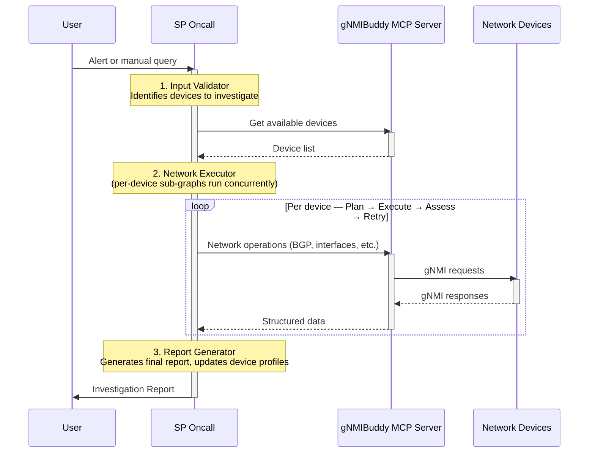

# SP Oncall: Multi-Agent Network Investigation

[](https://developer.cisco.com/codeexchange/github/repo/jillesca/sp_oncall)

SP Oncall is an experiment about a network investigation system that automates complex network diagnostics and troubleshooting for Service Provider (SP) networks. It uses artificial intelligence to analyze network devices, identify issues, and provide detailed reports. I'm mostly using it to learn and demo about AI solutions for networking.

## What Does It Do?

Think of SP Oncall as a team of specialized AI agents that work together to investigate network problems:

- **Input Validator** — Understands the incoming alert or query and identifies which network devices to investigate.
- **Planner** — Creates a customized investigation strategy for each device (runs inside the Executor, per device).
- **Executor** — Runs network commands concurrently per device. Internally loops through Plan → Execute → Assess → Retry until the objective is achieved or retries are exhausted.
- **Assessor** — Evaluates whether the investigation found what it was looking for; triggers a retry if not (runs inside the Executor).
- **Reporter** — Generates a final report and updates each device's profile for use in future investigations.

## Quick Demo

Watch [SP Oncall in Action](https://app.vidcast.io/share/71c7937d-645d-4226-87c6-883b49c0e4f3) (2:25) showing how to query the network using natural language.

## Architecture

The outer graph is a linear pipeline. The retry and planning logic is encapsulated inside a per-device sub-graph that the Executor runs concurrently for each device.


```mermaid
sequenceDiagram
    participant User
    participant SPOncall as SP Oncall
    participant MCP as gNMIBuddy MCP Server
    participant Devices as Network Devices

    User->>SPOncall: Alert or manual query
    activate SPOncall

    Note over SPOncall: 1. Input Validator<br/>Identifies devices to investigate
    SPOncall->>MCP: Get available devices
    activate MCP
    MCP-->>SPOncall: Device list
    deactivate MCP

    Note over SPOncall: 2. Network Executor<br/>(per-device sub-graphs run concurrently)

    loop Per device — Plan → Execute → Assess → Retry
        SPOncall->>MCP: Network operations (BGP, interfaces, etc.)
        activate MCP
        MCP->>Devices: gNMI requests
        activate Devices
        Devices-->>MCP: gNMI responses
        deactivate Devices
        MCP-->>SPOncall: Structured data
        deactivate MCP
    end

    Note over SPOncall: 3. Report Generator<br/>Generates final report, updates device profiles
    SPOncall->>User: Investigation Report
    deactivate SPOncall
```

## Key Features

- **Alert-driven**: Prometheus fires an alert → webhook triggers the graph automatically. No human required to start an investigation.
- **Per-device memory**: Device Profiles accumulate static facts (role, BGP AS, neighbours) and dynamic facts (last alert, last known state) across runs — stored in the LangGraph Store, no external DB required.
- **Multi-device concurrency**: Investigations for multiple devices run in parallel inside the Executor.
- **Self-healing retry loop**: Each device retries internally (Plan → Execute → Assess) up to `max_retries` times before giving up.
- **Skill-based planning**: Investigation strategies live in `skills/` as Markdown files. The planner selects relevant skills based on the alert type.
- **Follow-up queries**: After an alert run completes, ask follow-up questions in the same LangGraph thread. Agents have full access to the investigation state.

## Prerequisites

Before you can use SP Oncall, you'll need these tools installed on your system:

- **Make** — A build automation tool that helps run common commands (install via your package manager).
- **[uv](https://docs.astral.sh/uv/#installation)** — A fast Python package manager (alternative to pip).
- **[OpenAI API Key](https://platform.openai.com/)** — Required if using OpenAI models (default). OpenRouter is also supported.
- **[LangSmith Account](https://smith.langchain.com/)** — For LangGraph Studio.
- **Network Devices** — Your actual network equipment, or use the [DevNet XRd Sandbox](https://devnetsandbox.cisco.com/DevNet/) for testing.

**Windows users**: This project requires a Unix-like environment. Install [WSL (Windows Subsystem for Linux)](https://docs.microsoft.com/en-us/windows/wsl/install) to run it on Windows.

## Quick Start

### 1. Clone and install

```bash
git clone https://github.com/jillesca/sp_oncall
cd sp_oncall
make install
```

### 2. Configure environment

Copy `.env.example` to `.env` and fill in the required values:

```bash
cp .env.example .env
```

Required keys:

| Variable            | Description                               |
| ------------------- | ----------------------------------------- |
| `OPENAI_API_KEY`    | OpenAI API key                            |
| `LANGSMITH_API_KEY` | LangSmith API key (for tracing)           |
| `LANGSMITH_PROJECT` | LangSmith project name (e.g. `sp_oncall`) |
| `LANGSMITH_TRACING` | Set to `true` to enable tracing           |

See the [Configuration Reference](#configuration-reference) below for all available options.

### 3. Configure network device access

SP Oncall uses [gNMIBuddy](https://github.com/jillesca/gNMIBuddy) MCP server to query network devices. Point `mcp_config.json` at your running gNMIBuddy instance:

```json
{
  "gNMIBuddy": {
    "transport": "http",
    "url": "http://localhost:8000/mcp"
  }
}
```

### 4. Start

```bash
make run
```

This starts the LangGraph development server. Open LangGraph Studio at the URL shown in the terminal.

### 5. Send a query

In LangGraph Studio, start a new thread and type a query:

```text
Check BGP neighbors on xrd-1
How are my PE routers performing?
Investigate all core P devices
```

For the alert-driven demo flow, see [Demo Workflow](#demo-workflow) below.

## Testing with DevNet Sandbox

Don't have network devices? No problem! Use the [DevNet XRd Sandbox](https://devnetsandbox.cisco.com/DevNet/) — a free environment for testing.

### Sandbox Setup

1. Reserve the DevNet **XRd Sandbox** (free account required).
2. Follow the sandbox instructions to start the containerized SR MPLS network using Docker.
3. Configure gNMI on the simulated devices.

To automatically configure gNMI on the XRd DevNet sandbox, run this helper script:

```bash
ANSIBLE_HOST_KEY_CHECKING=False \
bash -c 'TMPDIR=$(mktemp -d) \
&& trap "rm -rf $TMPDIR" EXIT \
&& curl -s https://raw.githubusercontent.com/jillesca/gNMIBuddy/refs/heads/main/ansible-helper/xrd_apply_config.yaml > "$TMPDIR/playbook.yaml" \
&& curl -s https://raw.githubusercontent.com/jillesca/gNMIBuddy/refs/heads/main/ansible-helper/hosts > "$TMPDIR/hosts" \
&& uvx --from "ansible-core==2.19.2" --with "paramiko,ansible" ansible-playbook "$TMPDIR/playbook.yaml" -i "$TMPDIR/hosts"'
```

<details>
<summary><strong>If you have problems with Ansible</strong></summary>

You can manually enable gNMI on each XRd device. Apply this configuration to all XRd devices:

```bash
grpc
 port 57777
 no-tls
```

Don't forget to `commit` your changes to XRd.

</details>

## Configuration Reference

All `SP_ONCALL_*` variables can be set in your `.env` file. See `.env.example` for the full list with comments.

| Variable                          | Default            | Description                                                                                                       |
| --------------------------------- | ------------------ | ----------------------------------------------------------------------------------------------------------------- |
| `SP_ONCALL_MAX_RETRIES`           | `3`                | Max execution retries per device investigation. Also overridable from LangGraph Studio.                           |
| `SP_ONCALL_FAST_MODEL`            | `openai/gpt-4o-mini` | Model used for structured output parsing — faster and cheaper than the main reasoning model.                    |
| `SP_ONCALL_LOG_LEVEL`             | `info`             | Log level for sp_oncall modules (`debug` \| `info` \| `warning` \| `error`).                                     |
| `SP_ONCALL_LANGCHAIN_DEBUG`       | `false`            | Enable verbose LangChain debug tracing.                                                                           |
| `SP_ONCALL_MODULE_LEVELS`         | —                  | Per-module log overrides (e.g. `sp_oncall.nodes=debug,langgraph=error`). Run `make logger-names` to list modules. |
| `SP_ONCALL_LOG_FILE`              | —                  | Write logs to a file in addition to stdout.                                                                       |
| `SP_ONCALL_EXTERNAL_SUPPRESSION_MODE` | `langgraph`    | Suppress noisy external library logs (`langgraph` \| `none`).                                                    |
| `OPENROUTER_API_KEY`              | —                  | Required only when using `openrouter/*` models (e.g. `openrouter/anthropic/claude-sonnet-4`).                    |

### AI model selection

In LangGraph Studio, click **Manage Assistants** to select the main reasoning model. Available models are defined in `src/configuration.py` under `LLMModel` and include OpenAI and OpenRouter options.

### Investigation skills

Investigation strategies live in `skills/` as Markdown files. When an alert fires, the planner selects skills based on the alert's `event_type`. For manual queries, all skills are available. See `src/util/skill_routing.py` for the routing table.

For detailed logging configuration, see [src/logging/README.md](src/logging/README.md).

For domain terminology (Alert, Investigation, Device Profile, Thread, etc.), see [CONTEXT.md](CONTEXT.md).

---

## Demo Workflow

The primary demo path is alert-driven: an observability system fires a webhook that triggers a background investigation, and the presenter joins the running thread in LangGraph Studio.

### Thread-per-Alert flow

1. **Alert fires** — Prometheus detects a network event and sends it to Alertmanager → Grafana → webhook container.
2. **Webhook container** (`POST /alert`) transforms the Grafana payload into a `NetworkAlert` and calls `POST /runs` on the LangGraph API.
3. **sp_oncall graph runs** in the background: `input_validator → network_executor → report_generator`. The executor plans, executes, and assesses each device concurrently.
4. **Open LangGraph Studio** and join the thread by its ID to watch the investigation live.
5. **Ask follow-up questions** in the same thread — agents have full access to the investigation state.

### Triggering a test alert manually

Use `scripts/test_alert.sh` to send a fake alert to the webhook container:

```bash
# Show the curl commands without sending (dry run)
bash scripts/test_alert.sh --dry-run

# Send a specific alert type
bash scripts/test_alert.sh interface_down
bash scripts/test_alert.sh bgp_down
bash scripts/test_alert.sh isis_down
bash scripts/test_alert.sh topology_degraded
bash scripts/test_alert.sh interface_flapping
bash scripts/test_alert.sh interface_errors
```

The webhook container must be running (`docker compose up webhook-receiver`) and the LangGraph server must be reachable at `http://localhost:2024`.

## Getting Help

- **Issues**: Check the [GitHub issues](https://github.com/jillesca/sp_oncall/issues) page
- **Questions**: Open a new issue with your question
- **Contributing**: Right now this is proof of concept experiment. Feel free to fork.

## Learn More

- **gNMI**: [gRPC Network Management Interface](https://github.com/openconfig/reference/blob/master/rpc/gnmi/gnmi-specification.md)
- **LangGraph**: [LangChain's workflow framework](https://langchain-ai.github.io/langgraph/)
- **DevNet Sandbox**: [Cisco's free network simulation environment](https://devnetsandbox.cisco.com/DevNet/)
