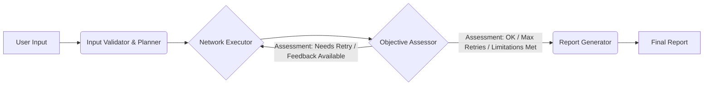

# Agent Architecture Plan

**Core Goal:** Take a user query about a specific network device, execute relevant checks based on predefined **natural language plans** using the `gNMIBuddy` tool (via the MCP protocol), and generate a report summarizing the findings or identifying tool limitations.

**Proposed Architecture (4 Core Nodes):**

1. **`Input Validator & Planner` Node:**

   - **Responsibilities:**
     - Receives the initial user request (e.g., "Check BGP neighbors on xrd-1", "What interfaces are up on pe1?", "Review P device core-rtr-2").
     - **Explicitly uses the `gNMIBuddy.get_devices()` function** to validate the requested `device_name` against the known inventory. Rejects if invalid.
     - Parses the user request to understand the basic `intent`. Initial implementation will use keyword matching and simple classification (e.g., presence of "BGP", "interface", "MPLS", "VPN", "review PE" mapped to corresponding intents).
     - Sets a clear, concise `objective` based on the validated input and intent (e.g., "Check BGP neighbor status for all neighbors on xrd-1", "Summarize operational state for all interfaces on pe1", "Perform standard P device review checks on core-rtr-2").
     - Selects a **pre-defined `working_plan`** based on the `intent` by loading the corresponding **JSON plan file** (see "Guidelines for Creating Plans").
     - Initializes or updates the graph's state object, populating `working_plan_steps` with the natural language steps from the loaded JSON plan.
     - Initializes `max_retries` (e.g., to 2 or 3) and `current_retries` to 0 in the state.
   - **LLM Use:** Minimal. Rule-based logic for intent extraction and plan selection. Tool use required for `gNMIBuddy.get_devices()`.
   - **Output:** Updates the state with `device_name`, `objective`, `working_plan_steps`, `max_retries`, and `current_retries`.

2. **`Network Executor` Node:**

   - **Responsibilities:**
     - Receives `working_plan_steps`, `objective`, `device_name`, and potentially `assessor_feedback_for_retry` from the state.
     - Iterates through each natural language instruction in the `working_plan_steps` list.
     - For each step, uses its **LLM with tool-use capabilities** to:
       - **Interpret the natural language instruction** (and any `assessor_feedback_for_retry`).
       - **Dynamically select the most appropriate `gNMIBuddy` tool function(s)** (e.g., `get_routing_info`, `get_interface_info`) needed to fulfill the instruction's goal.
       - **Determine the necessary parameters** for the selected function(s), potentially using context from the objective or results from previous steps.
       - **Execute the chosen `gNMIBuddy` function(s)** via the MCP protocol against the target `device_name`.
     - Collects the results (or errors) from each executed tool call, associating them with the corresponding natural language step in the `execution_results` list within the state.
     - If a tool call fails (e.g., MCP error, gNMI error, function-specific error), records detailed error information. Aggregates significant failures or steps that couldn't be executed into the `tool_limitations_report`.
     - If this is a retry (indicated by `assessor_feedback_for_retry` being present), the executor should aim to address the feedback.
   - **LLM Use:** Heavy. The LLM is responsible for understanding natural language, mapping it to available tools (`gNMIBuddy` functions), determining parameters, and executing the tools, potentially guided by retry feedback. The LLM within this node should be initialized using the project's standard approach: `Configuration.from_context()` to get settings and `load_chat_model()` to instantiate the model, typically within an agent created by `create_react_agent` as this node uses tools.
   - **Output:** Updates the state with `execution_results` (tracking tool calls per step) and `tool_limitations_report`.

3. **`Objective Assessor` Node:**

   - **Name**: `Objective Assessor` Node
   - **Responsibilities**:
     - Receives `objective`, `working_plan_steps`, `execution_results`, `tool_limitations_report`, `max_retries`, and `current_retries` from the state.
     - Compares the `execution_results` against the `objective` to determine if the information gathered is sufficient and relevant.
     - **Decision Logic & Loop Control**:
       - If the `objective` is met, it sets `objective_achieved_assessment` to `True` and allows the flow to proceed to the `Report Generator`.
       - If the `objective` is not met, but `tool_limitations_report` indicates that further execution is unlikely to yield better results (or the issue is clearly a tool/device limitation), it sets `objective_achieved_assessment` to `True` and records this reason in `assessor_notes_for_final_report`.
       - If the `objective` is not met and a retry is feasible:
         - It checks if `current_retries` is less than `max_retries`.
         - If yes, it increments `current_retries`, sets `objective_achieved_assessment` to `False`, and populates `assessor_feedback_for_retry` with guidance for the `Network Executor`'s next attempt. The flow then loops back to the `Network Executor`.
         - If no (max retries reached), it sets `objective_achieved_assessment` to `True` (to break the loop), and records that max retries were hit in `assessor_notes_for_final_report`.
     - Populates `assessor_notes_for_final_report` with a summary of its assessment (e.g., "Objective met," "Objective partially met due to specific limitations," "Proceeding after max retries").
   - **LLM Use**: Moderate. An LLM is used to semantically compare the `execution_results` with the `objective` and to generate constructive `assessor_feedback_for_retry` if needed. The LLM should be initialized using `Configuration.from_context()` and `load_chat_model()`. If this node evolves to require its own tool use for assessment, it should then be structured using `create_react_agent`.
   - **Output**: Updates the state with `objective_achieved_assessment`, `current_retries` (if incremented), `assessor_feedback_for_retry` (if retrying), and `assessor_notes_for_final_report`.

4. **`Report Generator` Node:**
   - **Responsibilities:**
     - Receives `objective`, `working_plan_steps`, `execution_results`, `tool_limitations_report`, and `assessor_notes_for_final_report` from the state.
     - Analyzes the outcomes stored in `execution_results` in the context of the original `objective`, the intended `working_plan_steps`, and the `assessor_notes_for_final_report`. The primary analysis method involves using an LLM to synthesize the structured data from `execution_results` and the assessor's notes.
     - Generates a concise, human-readable `summary` report.
     - Highlights key findings relevant to the `objective`.
     - If the objective could not be fully met (as indicated by `assessor_notes_for_final_report` or `tool_limitations_report`), clearly states this, presents available partial findings, and summarizes the limitations encountered.
   - **LLM Use:** Uses an LLM (e.g., Mistral-Nemo, Hermes) to synthesize structured results, error reports, and assessor notes into a natural language `summary`. The LLM should be initialized using `Configuration.from_context()` and `load_chat_model()`. This node, as defined, performs text generation and does not use tools; therefore, a direct LLM call is appropriate.
   - **Output:** Updates the state with the final `summary`.

**Graph Flow:**



## Agent Implementation with LangGraph ReAct

We will use `create_react_agent` from `langgraph.prebuilt` to build ReAct-style agents, especially for nodes like the `Network Executor` that require LLM-driven tool use and conversational flow. This simplifies the construction of such agents.

Key parameters for our implementation include:

- **`model`**: Specifies the tool-calling capable LangChain chat model (e.g., from `langchain_openai`, `langchain_ollama`) for agent reasoning and decision-making.
- **`tools`**: A list of tools the agent can invoke, primarily `gNMIBuddy` functions accessed via the MCP layer.
- **`prompt`**: Customizes agent behavior using a system prompt (string, `langchain_core.prompts.SystemMessage`, `Callable`, or `Runnable`) to guide the LLM, define its persona, or provide task-specific instructions.

`create_react_agent` compiles a graph where an "agent" node (which calls the LLM) alternates with a "tools" node (which executes tool calls requested by the LLM). This cycle repeats until the LLM generates a final response without further tool calls.

This approach is primarily intended for the `Network Executor` node, given its reliance on LLM-driven tool selection and execution. Other nodes that require an LLM to dynamically select and execute tools should also adopt this pattern. Nodes that use LLMs for tasks not involving tool execution (e.g., text synthesis, data analysis without calling external tools based on that analysis) can make direct calls to the LLM, ensuring the LLM is initialized consistently using `Configuration.from_context()` and `load_chat_model()`.

## Mapping Architecture to Project File Structure

The components of this agent architecture will primarily reside within the `src/sp_oncall/` Python module. This modular approach helps in organizing the codebase effectively. Below is a guideline on how the architectural nodes and key elements map to the file structure:

**Project Root:**

- **`plans/`**: This directory, located at the project root (e.g., `/root/tmp-clus25-workshopt/plans/`), will store all the JSON plan files (e.g., `general_device_health_check.json`, `check_bgp_neighbors.json`). Each file defines an intent, description, and a series of natural language steps.

**`src/sp_oncall/` Module:**

- **`state.py`**:
  - Defines the core `GraphState` `TypedDict`.
  - Includes definitions for related data structures like `ExecutedToolCall` and `StepExecutionResult`.
- **`planner.py` (New or Enhanced):**
  - Implements the logic for the **`Input Validator & Planner`** node.
  - Handles user input validation, `device_name` validation (using `gNMIBuddy.get_devices()`), intent parsing, `objective` setting, and loading the appropriate `working_plan_steps` from the `plans/` directory.
  - Initializes retry counts (`max_retries`, `current_retries`).
- **`executor.py` (New):**
  - Contains the implementation of the **`Network Executor`** node.
  - Manages LLM interactions for interpreting natural language plan steps (and `assessor_feedback_for_retry`).
  - Dynamically selects `gNMIBuddy` tool functions and their parameters.
  - Handles the execution of `gNMIBuddy` functions via the MCP protocol.
  - Populates `execution_results` and `tool_limitations_report` in the `GraphState`.
- **`assessor.py` (New):**
  - Implements the logic for the **`Objective Assessor`** node.
  - Compares `execution_results` against the `objective`.
  - Manages the retry loop logic: updates `current_retries`, sets `objective_achieved_assessment`, and generates `assessor_feedback_for_retry` or `assessor_notes_for_final_report`.
- **`reporter.py` (New):**
  - Houses the implementation of the **`Report Generator`** node.
  - Uses an LLM to synthesize the final `summary` based on the `GraphState` (objective, results, limitations, assessor notes).
- **`graph.py` (Existing/Core):**
  - Defines the main LangGraph application.
  - Wires together the nodes: `Input Validator & Planner`, `Network Executor`, `Objective Assessor`, and `Report Generator`.
  - Manages the overall control flow, including conditional edges for the retry loop and progression to the final report.
- **`tools.py` (Existing):**
  - Can be used for helper functions related to tool interactions, such as wrappers or utility functions for preparing `gNMIBuddy` calls if needed before they are handed off to the MCP layer.
  - The primary interaction with `gNMIBuddy` is expected to be via MCP as defined by the tool's JSON configuration, but any Python-side marshalling or specific client logic could reside here.
- **`prompts.py` (Existing):**
  - Centralizes all LLM prompts used by the `Network Executor`, `Objective Assessor`, and `Report Generator` nodes.
- **`configuration.py` (Existing):**
  - Stores static configurations, such as default values for `max_retries`, LLM model identifiers, API keys (if not using environment variables), or other system-wide settings.
- **`utils.py` (Existing):**
  - Contains general-purpose utility functions shared across different parts of the `sp_oncall` module.
- **`__init__.py` (Existing):**
  - Standard Python file to mark `src/sp_oncall/` as a package.

This structure aims to provide a clear separation of concerns, making the codebase easier to navigate, develop, and maintain as the agent's capabilities expand. Each node's logic is encapsulated within its own file, while shared elements like state, prompts, and graph definition are managed centrally.

**State Object Example (`TypedDict`):**

```python
from typing import TypedDict, List, Dict, Any, Optional

# Represents the details of a specific tool call made by the executor LLM
class ExecutedToolCall(TypedDict):
    function: str # Name of the gNMIBuddy function called (e.g., "get_routing_info")
    params: Dict[str, Any] # Parameters used for the function call
    result: Optional[Dict[str, Any]] # Structured result from gNMIBuddy (if successful)
    error: Optional[str] # Error message (if failed)

# Represents the outcome of executing one natural language plan step
class StepExecutionResult(TypedDict):
    step_index: int # Index of the natural language step in the plan (0-based)
    natural_language_instruction: str # The instruction that was attempted
    executed_calls: List[ExecutedToolCall] # List of actual tool calls the LLM made for this step

class GraphState(TypedDict):
    user_query: str
    device_name: str
    objective: str                     # Set by Input Validator & Planner
    working_plan_steps: List[str]      # Set by Input Validator & Planner
    execution_results: List[StepExecutionResult] # Appended to by Network Executor
    tool_limitations_report: Optional[str]   # Updated by Network Executor, potentially refined by Assessor

    # Fields for the Objective Assessor node and loop control
    max_retries: int                   # Initialized by Input Validator & Planner (e.g., 2 or 3)
    current_retries: int               # Initialized to 0 by Input Validator & Planner, incremented by Objective Assessor
    objective_achieved_assessment: Optional[bool] # Set by Objective Assessor. True to proceed to report, False to retry.
    assessor_feedback_for_retry: Optional[str] # Set by Objective Assessor for Network Executor if retrying
    assessor_notes_for_final_report: Optional[str] # Set by Objective Assessor for Report Generator

    summary: Optional[List[str]]       # Final output from Report Generator, as a list of strings
```

**Guidelines for Creating Plans:**

- **Storage:** Plans must be stored as individual JSON files within the `plans/` directory.
- **Naming:** The filename must correspond to the `intent` it represents (e.g., `check_bgp_neighbors.json`).
- **Format:** Each JSON file must adhere to the following structure:

```json
{
  "intent": "string", // Unique identifier for the plan (matches filename without extension)
  "description": "string", // Brief explanation of the plan's purpose
  "steps": [
    "string", // Natural language instruction for step 1
    "string", // Natural language instruction for step 2
    ...
  ]
}
```

- **Content (`steps`):**

  - Instructions must be written in clear, unambiguous natural language.
  - Write each step as a clear instruction for a junior engineer learning network diagnostics. Focus on _what_ to investigate (e.g., "Check BGP neighbor stability", "Examine interface error counters") and potentially _why_ (e.g., "to ensure core connectivity is stable"). Guide them on what constitutes normal versus potentially problematic findings for that check. The agent will interpret this guidance and determine the appropriate `gNMIBuddy` commands to gather the necessary information.
  - Steps should represent logical, sequential actions needed to fulfill the plan's `intent`.
  - Consider implicit branching or conditions (e.g., "If any BGP neighbors are down, check the logs for errors related to BGP."). The `Network Executor` LLM is expected to interpret these conditions based on the results of previous steps when deciding which tools to use for the current step.
  - Focus on _what_ needs to be checked or retrieved, not _how_ in terms of specific tool syntax.

- **Initial Plans to Create:** Agents should create the following initial plan files in the `plans/` directory adhering to the above guidelines:
  - `check_bgp_neighbors.json`
  - `check_interface_status.json` (Should handle both summary view and potentially checking a specific interface mentioned in the original user query context, if possible)
  - `review_pe_device.json`
  - `review_p_device.json`
  - `review_rr_device.json`
  - `troubleshoot_vpn_vrf.json` (Should handle checking a specific VRF based on user query context)
  - `check_mpls_state.json` (General MPLS/SR/LDP checks)
  - `general_device_health_check.json`

**Review and Retry Loop:**

The `Objective Assessor` node introduces a review and retry loop to enhance the quality and relevance of the information gathered by the `Network Executor`.

- **Review Process:** After the `Network Executor` completes its execution based on the `working_plan_steps`, the `Objective Assessor` evaluates if the `execution_results` adequately meet the original `objective`.
- **Retry Condition:** If the assessment determines the `objective` has not been met and further attempts might yield better results (and `current_retries` < `max_retries`), it triggers a retry.
  - The `Objective Assessor` provides `assessor_feedback_for_retry` to the `Network Executor`. This feedback can include suggestions for different tool parameters, a refined focus for certain steps, or areas that were missed.
  - `current_retries` is incremented.
- **Loop Termination:** The loop terminates under the following conditions:
  - The `Objective Assessor` deems the `objective` has been successfully met.
  - The `Objective Assessor` determines that tool limitations or device issues (captured in `tool_limitations_report`) prevent further meaningful progress, even if the objective isn't perfectly met.
  - The `current_retries` reaches the `max_retries` limit.
- **Reporting on Loop Outcome:** The `assessor_notes_for_final_report` field captures the reasoning for the final assessment (e.g., success, partial success due to limitations, max retries hit), which is then used by the `Report Generator`.

**Error Handling:**

- The `Network Executor` is responsible for catching errors during `gNMIBuddy` tool execution via MCP. Errors are recorded in the `error` field of the relevant `ExecutedToolCall` within `execution_results`.
- Errors can include: MCP communication failures, `gNMIBuddy` internal errors, device connection errors, authentication failures, gNMI protocol errors, or function-specific errors.
- The `tool_limitations_report` should summarize steps that failed significantly or couldn't be attempted due to tool limitations or inability of the LLM to interpret the step/find an appropriate tool. The `Objective Assessor` may also contribute to this understanding.
- The `Report Generator` uses the `error` fields, `tool_limitations_report`, and `assessor_notes_for_final_report` to inform the user about execution problems and the assessment outcome in the final `summary`.

**Initial Implementation Decisions:**

- **Device Role Definition:** Device roles (PE, P, etc.) will be **ignored** initially for plan selection, relying on specific intents derived from user queries (e.g., "review PE router X"). Plans themselves (`review_pe_device.json`, etc.) inherently target roles.
- **Input Validator & Planner Node Structure:** Keeping the `Input Validator & Planner` as a single node is considered appropriate for the current design, as its tasks form a cohesive setup phase.
- **Tool Implementation:** Relies on robust `gNMIBuddy` implementation and MCP integration.

**Primary Tool: gNMIBuddy (using MCP)**

The core interaction with network devices will be handled by a custom tool named `gNMIBuddy`.

- **Functionality:** `gNMIBuddy` retrieves network information using **gNMI and OpenConfig models**. Agents interact with `gNMIBuddy` solely through its defined functions via MCP.
- **Output:** Provides structured JSON output.
- **Interaction:** The `Network Executor` LLM dynamically selects and calls `gNMIBuddy` functions via MCP based on its interpretation of natural language plan steps. **Agents should not have specific `gNMIBuddy` function calls hardcoded in their prompts**, except for the `Input Validator & Planner` which explicitly uses `get_devices()`.
- **Inventory:** `gNMIBuddy`'s inventory handling is transparent to the agent.

**Tooling Setup Example (Agent Environment)**

(Example JSON remains the same, emphasizing placeholders)

```json
{
  "gNMIBuddy": {
    // Key representing the tool instance
    "command": "uv",
    "args": [
      "run",
      "--with",
      "mcp[cli],pygnmi,networkx", // Dependencies needed
      "mcp", // Command to run the MCP wrapper/server
      "run",
      "/path/to/your/gnmi_buddy_mcp_server.py" // Placeholder: Path to the script implementing gNMIBuddy logic via MCP
    ],
    "transport": "stdio", // Communication method (MCP often uses stdio)
    "env": {
      "NETWORK_INVENTORY": "/path/to/your/hosts.json" // Placeholder: Path to inventory file
    }
  }
}
```

This setup ensures the agent can communicate with the `gNMIBuddy` server process (using MCP) to execute the required gNMI functions.
