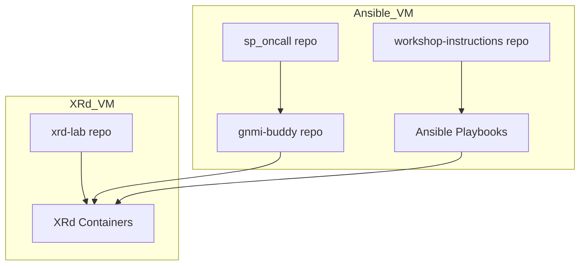

# Workshop Architecture & Repo Structure

## Overview

This workshop is designed for modularity and reusability. The project is split into several repositories, each with a clear purpose. This structure allows you to reuse tools in future workshops and makes the setup process straightforward for attendees.

## Repository Breakdown

- **xrd-lab**:  
  Contains all files needed to deploy Cisco XRd containers (docker-compose files, configs).  
  _Cloned on the XRd VM only._

- **gnmi-buddy**:  
  Standalone tool for gNMI operations.  
  _Cloned on the Ansible VM only._

- **sp_oncall**:  
  Standalone tool for service provider on-call automation.  
  _Cloned on the Ansible VM only._

- **workshop-instructions**:  
  This repo (the one you are reading now). Contains:
  - Step-by-step instructions
  - Ansible playbooks and inventory
  - Any helper scripts for the workshop  
    _Cloned on the Ansible VM only._

## High-Level Workflow

1. **XRd VM**:

   - Clone `xrd-lab`
   - Start XRd containers using provided configs

2. **Ansible VM**:

   - Clone `gnmi-buddy`, `sp_oncall`, and `workshop-instructions`
   - Use Ansible playbooks to configure XRd devices
   - Use gnmi-buddy and sp_oncall for automation and troubleshooting

3. **Attendees**:
   - Follow instructions in `workshop-instructions` to complete lab tasks

---

## Architecture Diagram



---

---

## Quick Setup Reference

### On XRd VM

```bash
git clone https://github.com/yourorg/xrd-lab.git
# Follow xrd-lab README to start containers
```

### On Ansible VM

```bash
git clone https://github.com/yourorg/gnmi-buddy.git
git clone https://github.com/yourorg/sp_oncall.git
git clone https://github.com/yourorg/workshop-instructions.git
# Follow workshop-instructions/README.md for next steps
```

---
